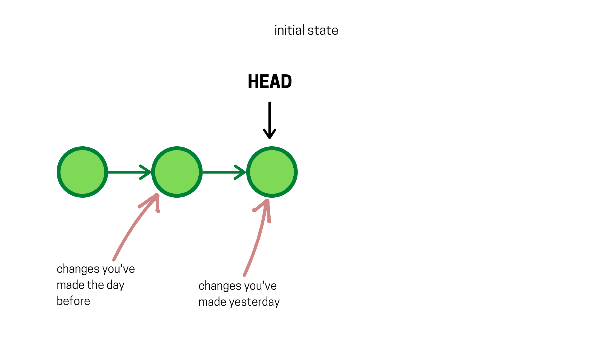
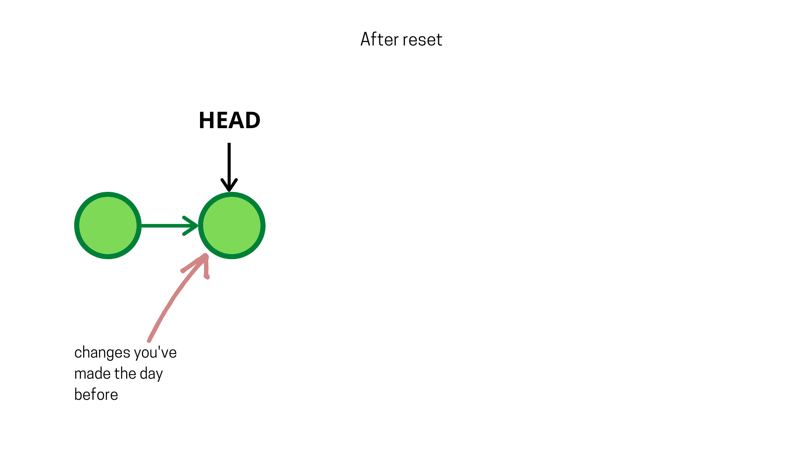
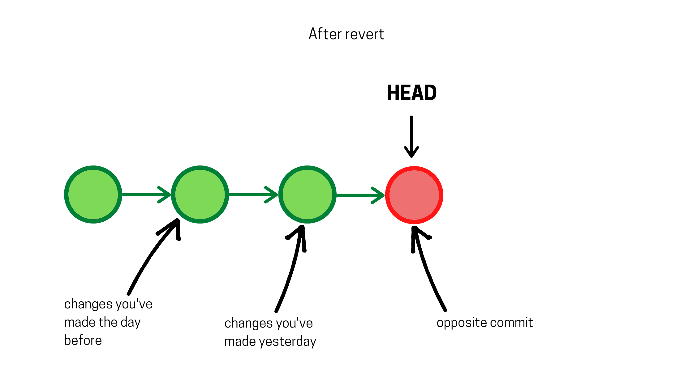

# Going back in time

---

---

# On this lesson you’ll learn how to:

- Undo unwanted changes.
- Learn the diffrence between reset and revert.

---

---

let's say you are in the middle of your project, with several commits in your history. You commit the changes you’ve made today, shut down your computer, and go to sleep.

On the next day, when you get to work, you decide that you don’t like the changes that you have've made yesterday, and you want to “erase” them. How would you do that?

Your first instinct will tell you to look up the edits that you’ve made and delete what you have added yesterday and add what you have deleted yesterday. But that is a lot of work :( and you don’t even remember what you have changed.

Here enter Git to save your life (well maybe not your life, but it will definetly save your time)

Because Git takes snapshots of your code everytime you commit, it knows the changes you’ve made from one commit to another.

Knowing that you decide to look into git to see the changes you’ve made, then you go undo them one by one.

Not so fast, why bother doing all that work when Git can do it for you with a simple command?

What is this magic command you ask?

And there isn’t one command that does that. There is three!

I know, I know, why can't Git makes it simple for just one time in its life *sight*

So, the three magic commands are: reset, revert, and rebase. But watch out for the last one because it is dark magic *chills*

What is the difference between them? Which one you should use?

Well, it depends...

Let me explain to you what each one does seperatly, then we will see which one we are going to use.

Let us go back to our situation and try to fix it, we are here:

and we want to undo the last changes, which are represented by the last commit.

If we use git reset by running

    git reset --hard HEAD

our history will be like this...

What happen?

What the reset command do is quite simple, it changes the position of the HEAD and points it the commit you want.

In other words, our code will travel back in time to look like it used to be in the commit pointed to by HEAD.

Now, what about revert?

Just like reset, revert command will help you undo unwanted changes, but it does it differently.

Let us go back to our initial situation and try to fix it this time with the revert command, we are here:

then we run the revert command :

    git revert HEAD

and we find ourselves here:

Do you notice the difference?

What the revert command did is it took the unwanted commit and added an opposite commit to it, meaning, if a line is added in the unwanted commit, it gets removed in the revert commit, and if a line is removed in the unwanted commit, it gets added back in the revert commit, etc..

Another common thing between reset command and revert command is that you can go back to any past commit, and not just the last one.

Now, we get to choose which command you should use to wipe out your past?

But what about git rebase? _You shout_

The rebase command can’t only undo changes, but it can merge branches, and change the whole history of the repo, and because it is complicated and complex it will not be covered in this article. Like I said it is black magic, don’t mess up with black magic.

In a conclusion, both reset and revert command let you undo undesirable changes, but they do it in two different ways: reset clear the unwanted changes, and erase the commits made like nothing ever happened. While, revert apply an opposite commit on top of the unwanted commit to undo the undesirable modification, which leaves a trace of both actions in history.

As a rule of thumb, use git reset when you work on the repo alone and from one computer, or when you haven’t pushed the changes to remote just yet. Because it can cause horrible conflicts to other team mates others working on the same repo, and use git revert when you are collaborating with others, so you can maintain a consistent history throughout all the team.

---

---

© 2020 - DzCode - Nour Tine - Making the world a better place 🌎
